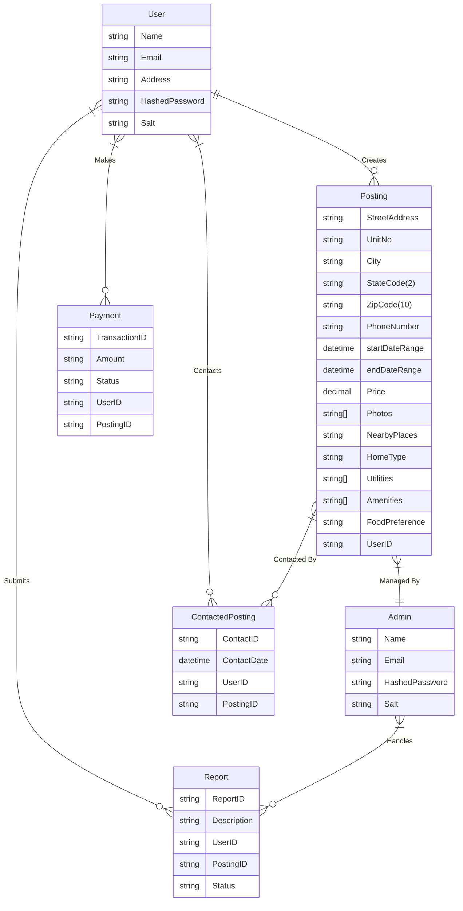
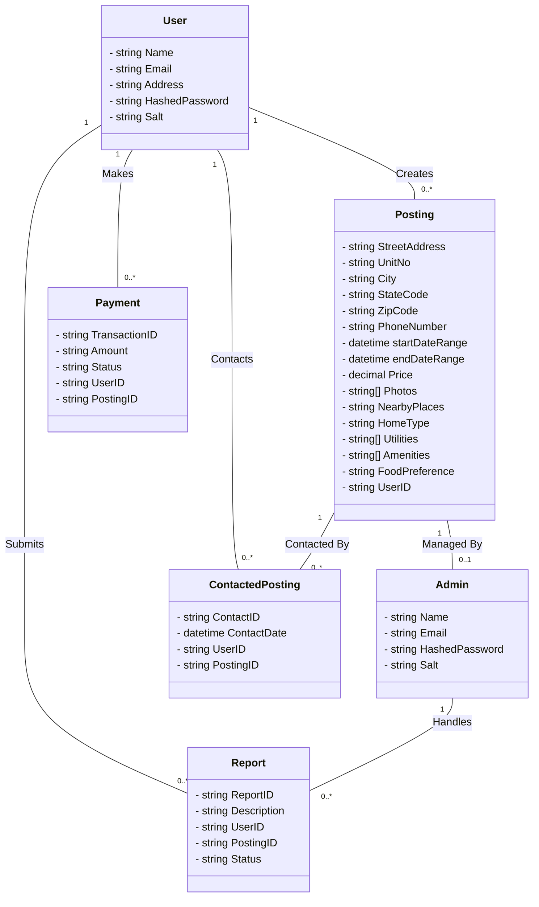
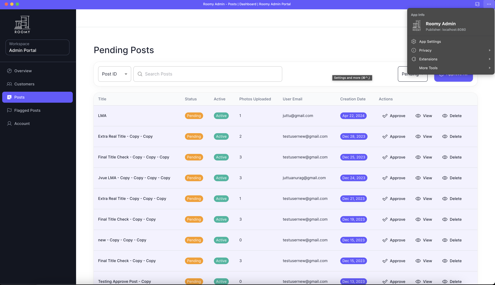
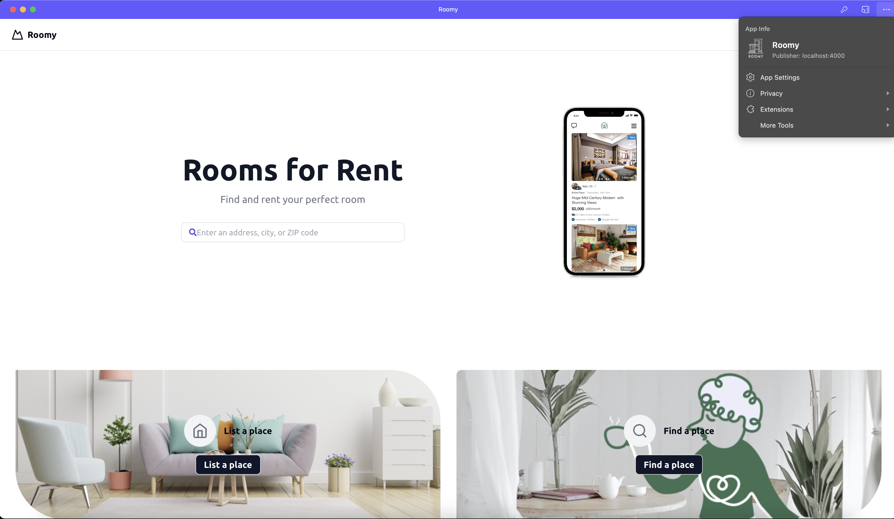
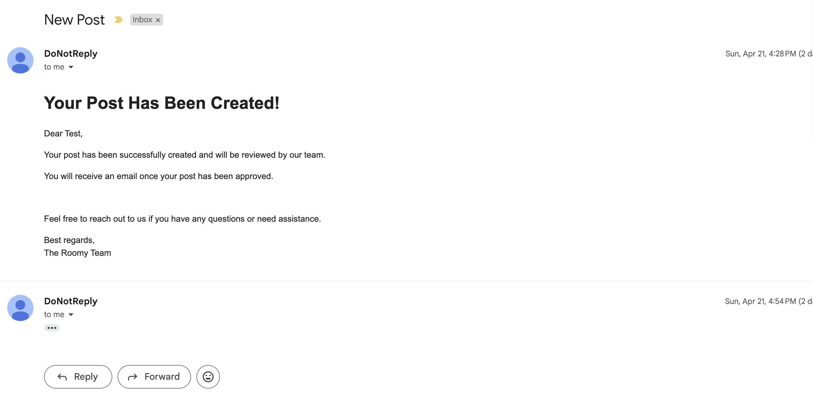
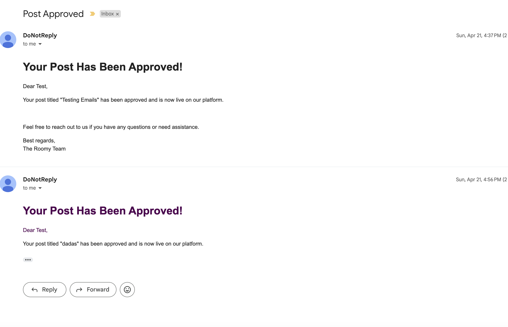
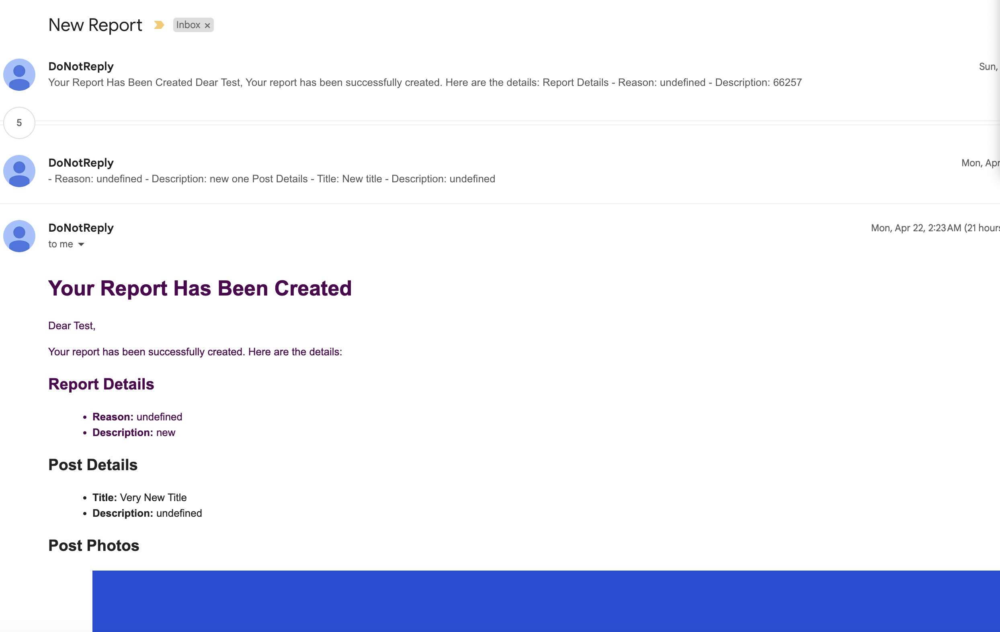

**Roomy**

## Quick start

- Clone the repo
- Make sure your Node.js and npm versions are up to date
- Start the Node.js server: `cd service && npm i && npm run start`
  - The server needs .env file
- Start the Admin Panel: `cd admin-portal && npm i && npm run dev -- -p 8080`
- Start the User Client: `cd roomy-client && npm i && npm run dev -- -p 4000`
- Both the admin panel and user client are PROGRESSIVE WEB APPS and can be installed on your device
- Video Demo: [Link](https://drive.google.com/file/d/1q_uOL25AXGmxvbhGtv3JoO7TlS3n--_U/view?pli=1)

## File Structure
- `service/` contains the backend server
  - `Node.js/Express.js/MongoDB`
- `admin-portal/` contains the admin portal
  - `Next.js/React.js`
- `roomy-client/` contains the user client
  - `Next.js/React.js`

Project Overview -

Problem :
Young students coming to the US for studies face a unique challenge: finding compatible roommates. Existing platforms focus on renting entire apartments, making it difficult to connect with potential roommates

Roomy’s solution : 
Effortless Roommate Matching. Forget endless scrolling and awkward meetups. Roomy connects you with compatible roommates who already have a place, making finding a perfect living situation a breeze......can you add this to read me ?

The Room Booking System is a web-based platform designed to facilitate the easy listing and booking of accommodations. Users can create listings for their available spaces, browse and contact postings, and process transactions securely. This application aims to streamline the process of finding short-term rentals for users by providing a user-friendly interface and a robust backend.

Team Members -

Huzaifa Malik - Huzaifa.ma@northeastern.edu

Jishnu Jemunigani - jemunigani.j@northeastern.edu

Keerthi Nethiguntla - nethiguntla.k@northeastern.edu

Juttu Gajendra Anurag - gajendraanurag.j@northeastern.edu

# Object Model

## Model for the application

### ER Diagram

### Class Diagram

    
    
    
    
    
