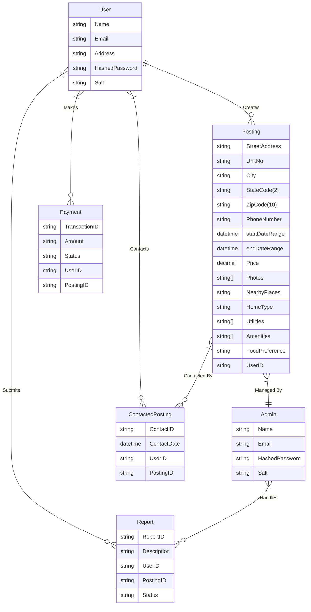
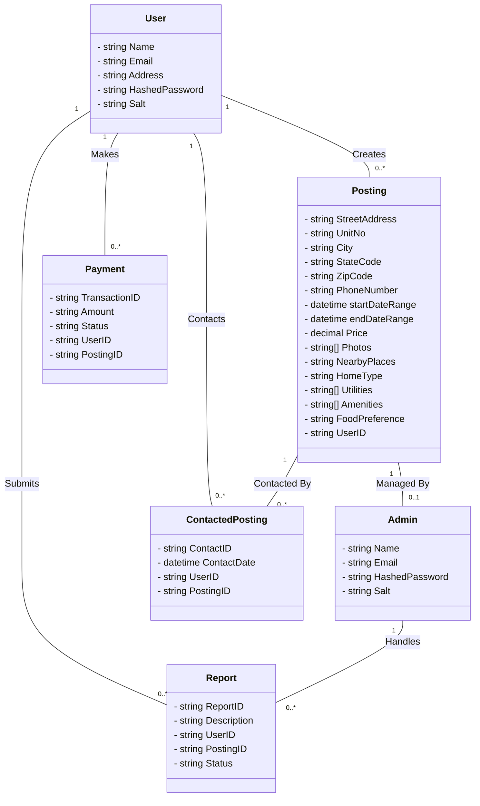

# Object Model

## Model for the application

### ER Diagram

```mermaid
erDiagram
    User {
        string Name
        string Email
        string Address
        string HashedPassword
        string Salt
    }
    Posting {
        string StreetAddress
        string UnitNo
        string City
        string StateCode(2)  
        string ZipCode(10)   
        string PhoneNumber      
        datetime startDateRange
        datetime endDateRange   
        decimal Price        
        string[] Photos     
        string NearbyPlaces  
        string HomeType      
        string[] Utilities   
        string[] Amenities   
        string FoodPreference 
        string UserID        
    }
    Admin {
        string Name
        string Email
        string HashedPassword
        string Salt
    }
    Payment {
        string TransactionID
        string Amount
        string Status
        string UserID
        string PostingID
    }
    Report {
        string ReportID
        string Description
        string UserID
        string PostingID
        string Status
    }
    ContactedPosting {
        string ContactID
        datetime ContactDate
        string UserID
        string PostingID
    }
    User ||--o{ Posting : "Creates"
    Posting }|--|| Admin : "Managed By"
    User }|--o{ Payment : "Makes"
    User }|--o{ Report : "Submits"
    Admin }|--o{ Report : "Handles"
    User }|--o{ ContactedPosting : "Contacts"
    Posting }|--o{ ContactedPosting : "Contacted By"

```

### Class Diagram

```mermaid
classDiagram
    class User {
        - string Name
        - string Email
        - string Address
        - string HashedPassword
        - string Salt
    }
    class Posting {
        - string StreetAddress
        - string UnitNo
        - string City
        - string StateCode
        - string ZipCode
        - string PhoneNumber
        - datetime startDateRange
        - datetime endDateRange
        - decimal Price
        - string[] Photos
        - string NearbyPlaces
        - string HomeType
        - string[] Utilities
        - string[] Amenities
        - string FoodPreference
        - string UserID
    }
    class Admin {
        - string Name
        - string Email
        - string HashedPassword
        - string Salt
    }
    class Payment {
        - string TransactionID
        - string Amount
        - string Status
        - string UserID
        - string PostingID
    }
    class Report {
        - string ReportID
        - string Description
        - string UserID
        - string PostingID
        - string Status
    }
    class ContactedPosting {
        - string ContactID
        - datetime ContactDate
        - string UserID
        - string PostingID
    }

    User "1" -- "0..*" Posting : Creates
    Posting "1" -- "0..1" Admin : Managed By
    User "1" -- "0..*" Payment : Makes
    User "1" -- "0..*" Report : Submits
    Admin "1" -- "0..*" Report : Handles
    User "1" -- "0..*" ContactedPosting : Contacts
    Posting "1" -- "0..*" ContactedPosting : Contacted By

```